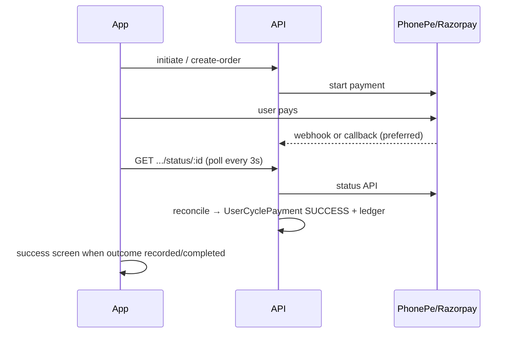

# Gateway payment troubleshooting (PhonePe + Razorpay)

Use this when the mobile app shows **Verifying payment…** for a long time, lands on **Confirming payment**, or maintenance dues do not update after paying.

## Two admin surfaces (important)

| Screen | API | What marks a villa “paid” |
|--------|-----|---------------------------|
| **Maintenance Management** (grid, financial dashboard) | `/maintenance-management/collection/...`, `/financial-dashboard` | `VillaMaintenanceSnapshot.status` + `MaintenancePayment` rows |
| **Maintenance Billing** (cycles / residents) | `/v1/admin/cycles`, `/v1/admin/residents/payments` | `UserCyclePayment.paymentStatus` + snapshot-backed ledger |

Gateway settlement must write **both** ledgers. Before this fix, `UserCyclePayment` could become `SUCCESS` while snapshots were never updated (billing cycle not linked to a collection cycle) — resident app looked “paid” in billing but **admin maintenance grid stayed unpaid**.

## How settlement works



The app **does not** mark maintenance paid locally. It waits until the server returns `outcome: recorded` or `completed` (or `status: SUCCESS`).

## Diagnose one transaction (local / Render shell)

From `backend/` with `DATABASE_URL` pointing at the same DB as production:

```bash
npm run diagnose:gateway-payment -- --gateway phonepe --id <merchantTransactionId>
npm run diagnose:gateway-payment -- --gateway razorpay --id <order_id>
```

Copy the txn id from the app’s **Confirming payment** screen (Reference) or from `BillingPaymentLog` / Render logs (`[phonepe status] poll result`).

## Render / production checklist

| Variable | PhonePe | Razorpay |
|----------|---------|----------|
| `API_BASE_URL` | **Required** — public HTTPS origin, no trailing slash, e.g. `https://your-api.onrender.com` | Used in docs; webhook URL is separate |
| `PHONEPE_MERCHANT_ID`, `PHONEPE_SALT_KEY`, `PHONEPE_SALT_INDEX`, `PHONEPE_ENVIRONMENT` | Global fallback if society has no PaymentMethod row | — |
| Per-society **PaymentMethod** (admin UI) | Overrides env; must match the merchant used at pay time | Razorpay key + secret (+ optional webhook secret) |
| `RAZORPAY_KEY_ID`, `RAZORPAY_KEY_SECRET`, `RAZORPAY_WEBHOOK_SECRET` | — | Global fallback |
| Webhook URL in gateway dashboard | `POST {API_BASE_URL}/api/v1/payments/phonepe/callback` | `POST {API_BASE_URL}/api/v1/payments/webhook` |

**Common failure:** `API_BASE_URL` unset or `http://localhost:4000` on Render → PhonePe never delivers callbacks; poll stays `pending` until status API sees success (or forever if credentials/env wrong).

**Common failure:** Society has PhonePe in DB with **PRODUCTION** keys but `PHONEPE_ENVIRONMENT=SANDBOX` in env (or vice versa) → status API returns 404 / pending.

**Common failure:** Razorpay webhook secret mismatch → `payment.captured` ignored; poll must reconcile via `orders.fetch` + `fetchPayments`.

## Read Render logs

After a test payment, search logs for:

- `[phonepe status] poll result` — `outcome`, `phonepeState`, `phonepeCode`, `reconciled`
- `[razorpay status] poll result` — `razorpayState`, `reconciled`
- `[phonepe webhook] payment settled` — callback path worked
- `[phonepe redirect] reconcile on return` — user returned from WebView; server attempted reconcile
- `Invalid signature` — webhook secret / PhonePe salt mismatch

## SQL quick checks

```sql
SELECT id, "paymentStatus", "paymentGatewayOrderId", "paymentGatewayPaymentId", "paidAt"
FROM "UserCyclePayment"
WHERE "paymentGatewayOrderId" = '<txn_or_order_id>';

SELECT status, "createdAt", "responsePayload"
FROM "BillingPaymentLog"
WHERE "cycleId" = '<cycle_id>'
ORDER BY "createdAt" DESC
LIMIT 10;
```

## Production sign-off

Before release:

1. One real (or sandbox) **single-cycle** payment per gateway → success screen within ~60s.
2. One **pay all** payment per gateway → all pending cycles marked paid.
3. `diagnose:gateway-payment` shows `outcome: completed` or `recorded` after pay.
4. Render has correct `API_BASE_URL` and webhook URLs registered at PhonePe/Razorpay.

## Mobile UX (app)

- Poll window ~2 minutes, then **Confirming payment** with **Check again** (no silent pop + toast).
- If diagnose shows `completed` but app still pending, force-quit and reopen **Check again** — usually a stale poll before server fix.
